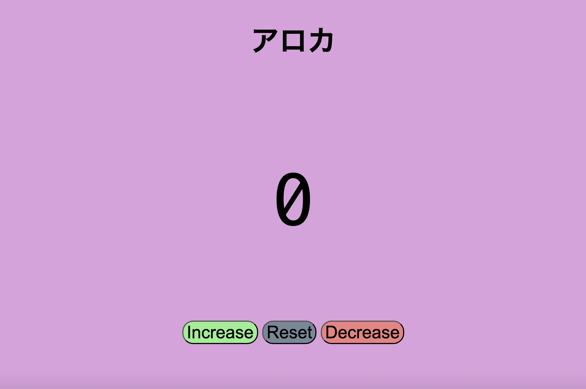

# NumberCountingProgram

**NumberCountingProgram** is a simple and interactive counter web app built with HTML, CSS, and JavaScript. It allows users to increase, decrease, or reset a number. Perfect for beginners learning basic web development, DOM manipulation, and event handling.



## 🚀 Features

- Count up and down with buttons  
- Reset count to 0  
- Styled with CSS for a clean, responsive look  
- Interactive button hover effects  

## 📁 Project Structure

```
NumberCountingProgram/
│
├── index.html
├── style.css
├── index.js
└── picture/
    └── 1.png
```

## 📦 How to Use

1. Clone the repo:
   ```bash
   git clone https://github.com/yourusername/NumberCountingProgram.git
   ```
2. Open `index.html` in your browser.

## 📸 Screenshot

The image below shows the UI of the NumberCountingProgram.


---

Enjoy counting! 😄
